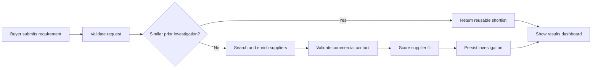
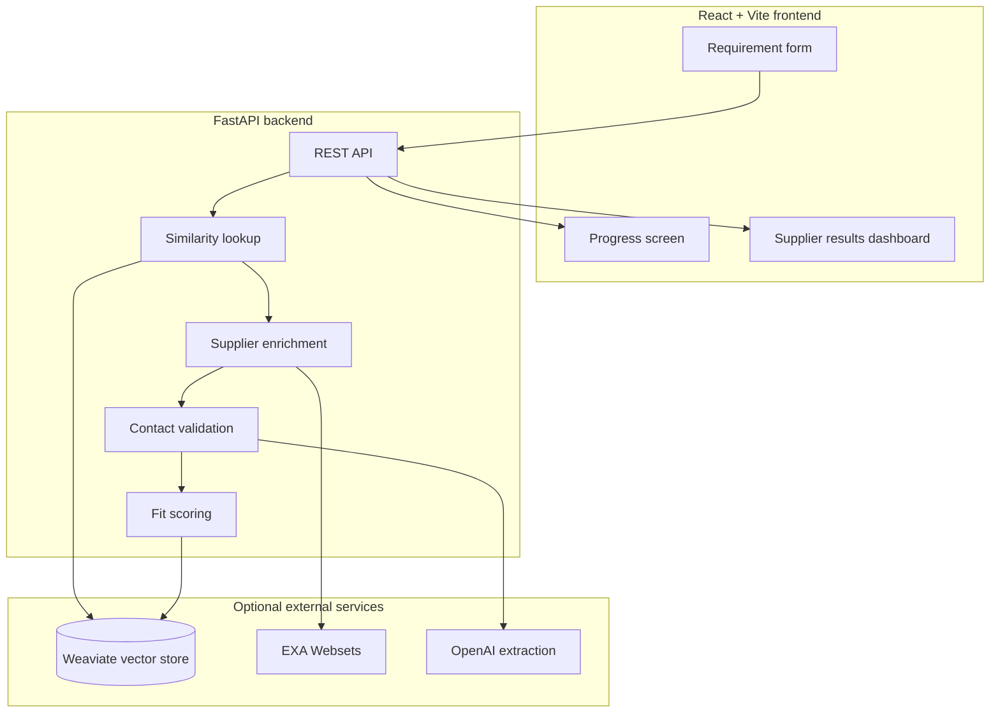

# Supplier Scout

Supplier Scout is a full-stack sourcing workflow that turns a buyer request into a qualified supplier shortlist. It captures requirements, checks prior sourcing work for reuse, enriches suppliers with external data, validates the right contact path, and presents a decision-ready result for procurement teams.

The application is designed as a credible product demo: it runs without paid credentials using deterministic sample suppliers, then upgrades to live Weaviate, EXA, and OpenAI integrations when API keys are configured.

## Business value

- **Compress supplier discovery cycles:** Buyers move from a blank research task to a structured shortlist in one workflow.
- **Reuse institutional knowledge:** Similar requirements can return cached investigations from Weaviate instead of repeating work.
- **Improve handoff quality:** Each result includes fit score, capabilities, contact route, and a conversation audit trail.
- **Reduce operational friction:** The UI keeps buyers focused on requirements while the backend handles enrichment, scoring, and persistence.

## Product workflow



The diagram shows the main value loop: new sourcing work becomes reusable knowledge, and repeated requirements become faster over time.

## Architecture at a glance



The backend degrades gracefully: if external credentials are missing, it returns deterministic demo data so the product story and UI can still be evaluated end to end.

More details:

- [Architecture guide](docs/architecture.md)
- [Presentation deck](docs/presentation-deck.md)
- [Backend API guide](backend/README.md)

## Tech stack

| Layer | Technology | Purpose |
| --- | --- | --- |
| Frontend | React, TypeScript, Vite, shadcn/ui, Tailwind CSS | Buyer intake, progress state, result review |
| Backend | FastAPI, Pydantic, Uvicorn | Typed API, orchestration, validation |
| Knowledge store | Weaviate | Vector similarity search and investigation persistence |
| Enrichment | EXA Websets | Supplier discovery and contact enrichment |
| AI extraction | OpenAI | Contact validation from supplier replies |

## Local setup

### Prerequisites

- Node.js 18+
- npm
- Python 3.11+

External service credentials are optional for local demos.

### Frontend

```bash
npm install
cp .env.example .env
npm run dev
```

The frontend runs at `http://localhost:8080` by default.

### Backend

```bash
cd backend
python3 -m venv .venv
source .venv/bin/activate
pip install -r requirements.txt
cp .env.example .env
uvicorn main:app --reload --host 0.0.0.0 --port 8000
```

The backend runs at `http://localhost:8000`.

## API endpoints

- `POST /api/v1/requirements` - submit buyer requirements and receive a supplier shortlist.
- `GET /api/v1/investigations/{investigation_id}/status` - retrieve progress or completed results.
- `GET /health` - check service health and which optional integrations are configured.

## Demo path

1. Start the backend without service credentials.
2. Start the frontend.
3. Submit a requirement such as "industrial temperature sensors with digital output".
4. Review the supplier cards, fit scores, and contact validation trail.
5. Add Weaviate/EXA/OpenAI credentials later to demonstrate live enrichment and reusable investigations.

## Quality checks

```bash
npm run lint
npm run build
python -m py_compile backend/main.py backend/create_collection.py
```

## Contributors

- Muslim
- Leandro
- David
- Moritz