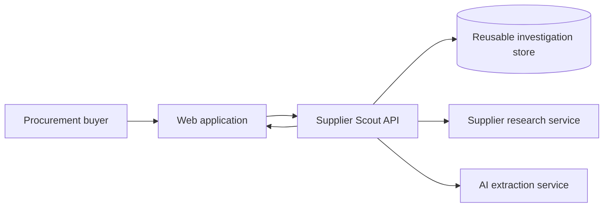
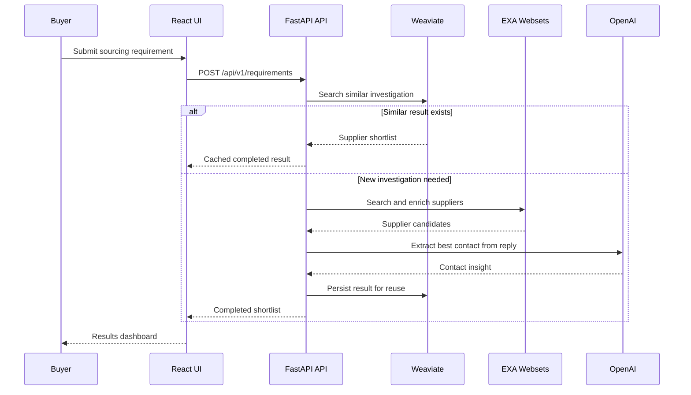
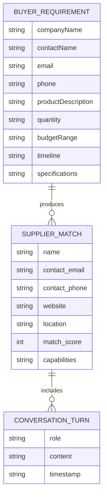

# Architecture Guide

Supplier Scout is organized around a single business outcome: shorten supplier discovery while making the reasoning behind each shortlist easy to inspect.

## System context

**What the visualization shows:** the buyer only interacts with the web application. The backend owns the orchestration work: reuse prior investigations, request new research, validate contact information, and return a structured decision package.

## Runtime flow

**What the visualization shows:** the cache branch is intentionally first because it is the highest-leverage part of the design. Every completed investigation can reduce future research effort for similar requirements.

## Component responsibilities

| Component | Responsibility | Why it matters |
| --- | --- | --- |
| Requirement form | Captures buyer, product, quantity, budget, timeline, and specifications | Converts unstructured sourcing asks into validated data |
| API orchestrator | Coordinates cache lookup, enrichment, contact validation, scoring, and persistence | Keeps the UI simple and the business workflow traceable |
| Weaviate store | Stores requirement text and supplier results for vector similarity reuse | Turns prior work into a reusable knowledge asset |
| EXA enrichment | Finds supplier candidates and contact evidence | Reduces manual research effort |
| OpenAI extraction | Reads supplier replies and extracts the next best contact | Moves the workflow closer to a buyer-ready handoff |
| Results dashboard | Shows fit score, capabilities, contact path, and audit trail | Helps stakeholders review the recommendation quickly |

## Data model

**What the visualization shows:** the result is not only a supplier name. It is a reviewable package with contact evidence, scoring, and a history of how the contact was identified.

## Demo and production modes

The backend supports two useful modes:

1. **Demo mode:** no external credentials are required. The API generates deterministic supplier examples, scores them, and returns contact validation logs. This keeps the product easy to evaluate.
2. **Integrated mode:** configure Weaviate, EXA, and OpenAI credentials to enable vector reuse, live supplier enrichment, and AI-assisted extraction.

## Operational notes

- `ALLOWED_ORIGINS` controls browser origins that can call the API.
- `SIMILARITY_DISTANCE` controls the Weaviate cache threshold. Lower values are stricter; higher values reuse more prior investigations.
- `EXA_WAIT_SECONDS` controls how long the backend waits before collecting EXA webset results.
- `/health` reports whether each optional integration is configured.
