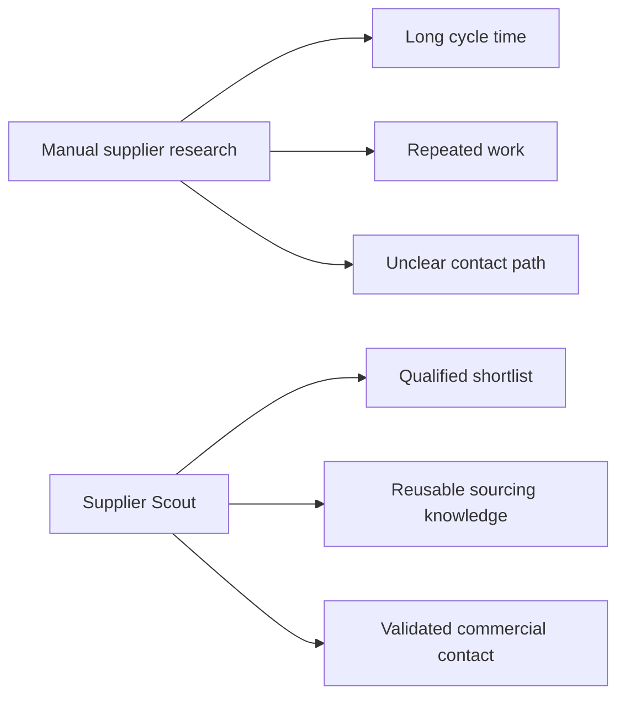
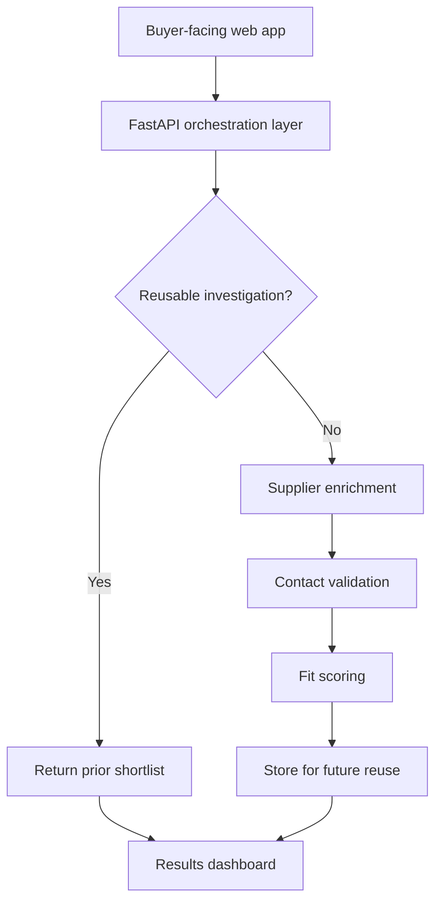
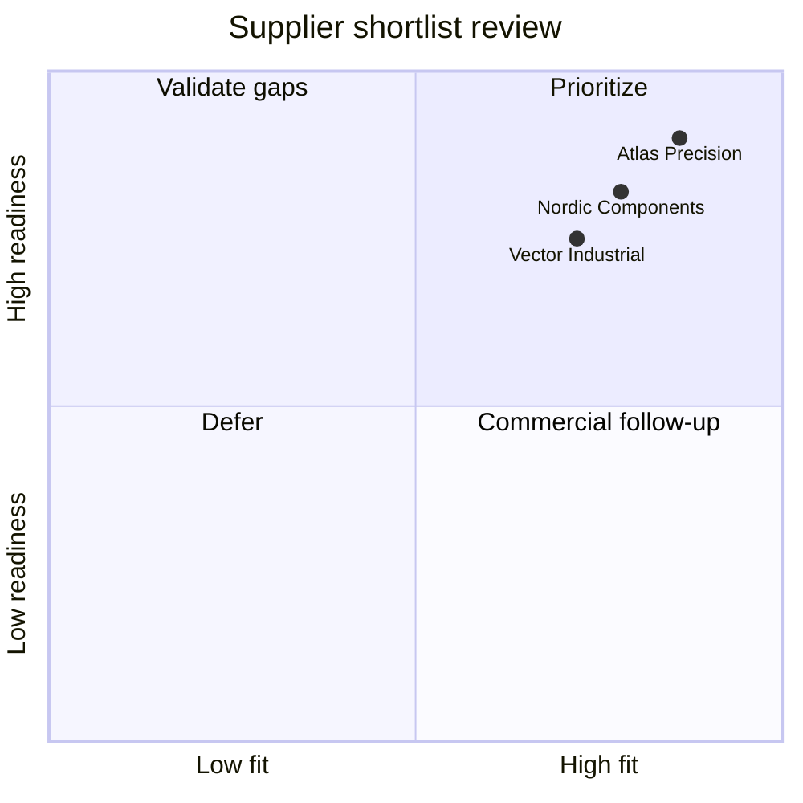

# Supplier Scout Presentation Deck

Use these three slides as a concise product narrative. Each slide includes speaker notes and explains what the visualization is intended to show.

---

## Slide 1: Business problem and value

**What the visualization shows:** the left side captures the common procurement pain: research is slow, context disappears, and handoffs are inconsistent. The right side shows the product response: a shortlist, reusable knowledge, and a validated contact route.

**Talk track:**

- Supplier discovery often starts with scattered web searches and inbox follow-ups.
- Supplier Scout structures the request, searches for reusable prior work, enriches suppliers, and returns a buyer-ready shortlist.
- The business value is faster sourcing, better continuity between requests, and clearer next steps for procurement teams.

**Key takeaway:** the product turns manual research into a repeatable workflow with measurable handoff quality.

---

## Slide 2: Architecture and automation flow

**What the visualization shows:** the system checks for reuse before doing new research. If no similar prior investigation exists, it enriches suppliers, validates contacts, scores fit, persists the result, and makes that work available for the next request.

**Talk track:**

- The frontend is intentionally simple: collect requirements and display decisions.
- The backend owns the workflow logic so integrations can change without redesigning the user experience.
- The reusable investigation loop is the strategic asset: the more requests the system handles, the more future work it can shortcut.

**Key takeaway:** this is not only a one-off search tool; it is a knowledge-building sourcing workflow.

---

## Slide 3: Decision-ready output

**What the visualization shows:** each supplier is evaluated on fit and readiness. Fit represents how closely the supplier aligns to the buyer's requirement. Readiness represents whether the system has enough contact and capability evidence for confident follow-up.

**Talk track:**

- The output is designed for action, not just discovery.
- Each supplier card includes fit score, capabilities, website, contact email, and the validation trail used to identify the commercial contact.
- Procurement teams can quickly prioritize high-fit, high-readiness suppliers and route lower-readiness options for additional validation.

**Key takeaway:** the dashboard supports a business conversation about which suppliers are ready for next-step engagement and why.
